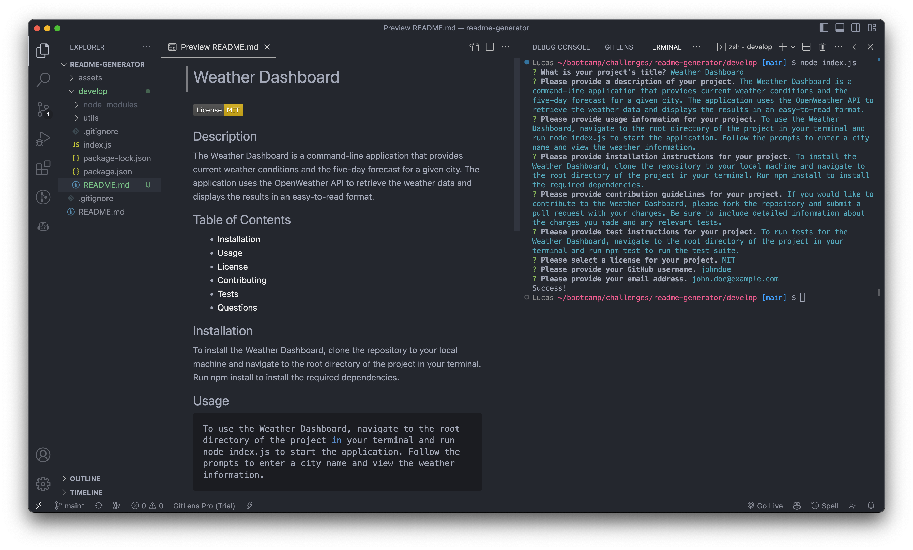

# README Generator
## Description
This is a professional README.md generator that uses NODE in the command-line to save developers precious time.

## Installation
To install, simply clone this repo to your local:
```bash
git clone git@github.com:skywalkah/readme-generator.git
```
## Usage

1. Navigate to the **develop** folder.
```bash
cd develop
```
2. Run the following command in your terminal
```bash
node index.js
```
Follow the prompts to complete your README.md. After entering all the info, your README will be created inside the **develop** folder.
## What it should look like

## Video recording
[Video saved in Google Drive](https://drive.google.com/file/d/1NUuEPccYewk6BmbH0X6IiY42vACjngDz/view)
## Credits
N/A
## Contributing
If you would like to contribute to this README generator, please fork the repository and submit a pull request with your changes. Be sure to include detailed information about the changes you made and any relevant tests.
## License
MIT license - Please refer to the LICENSE in the repo for more info.
